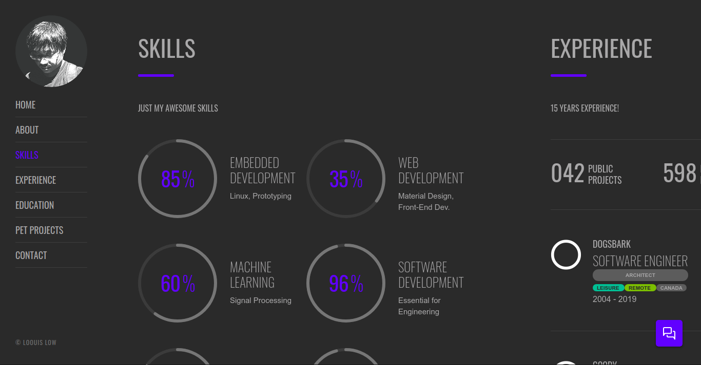
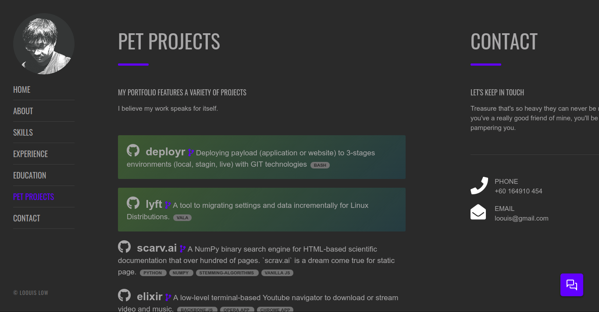

# My Personal Website

<p align="left">
  
  
  
  
  
  
  
</p>

## https://loouislow81.github.io

- About
- Skills
- Experience
- Education
- Pet Projects
- Contact

## build

I use only basic HTML and CSS with added little animation from jQuery. Whenever I make changes on the web page, I simply run the minifiers to make my website payload lighter and smaller easy for web browser to chew.

```bash
$ npm run build
```

Thanks for viewing.
