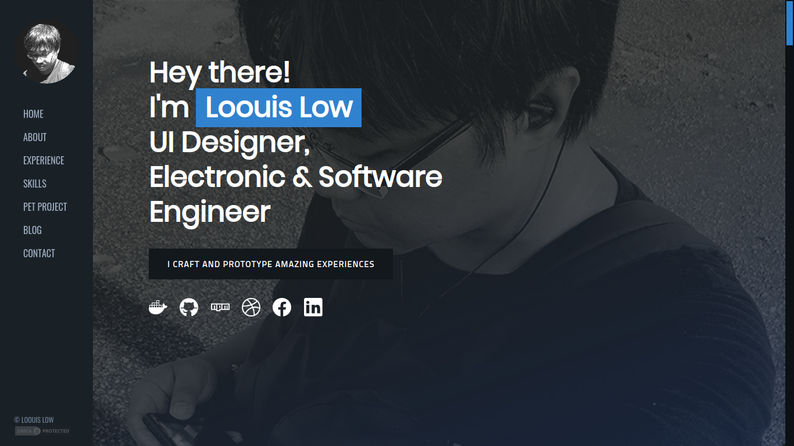
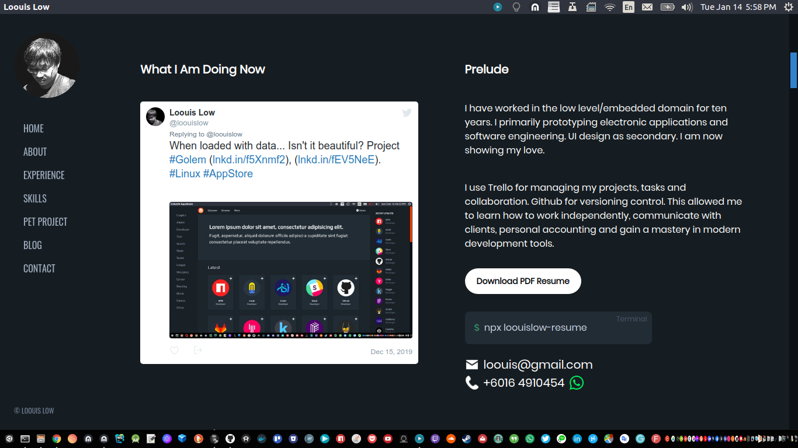
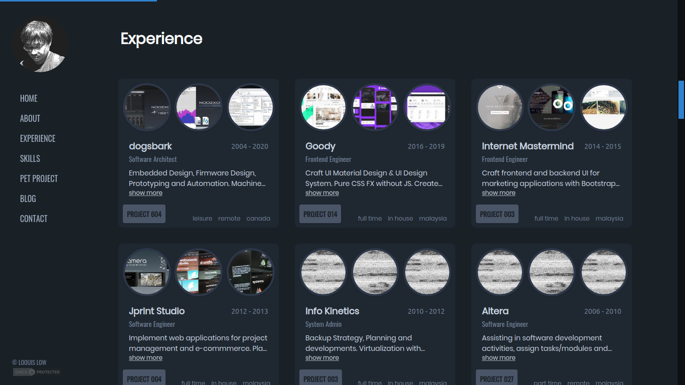
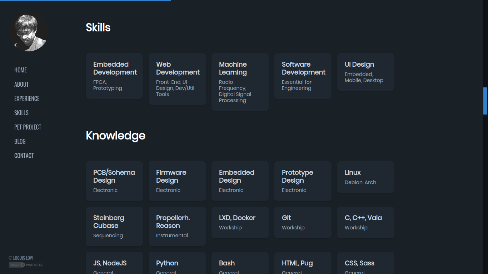
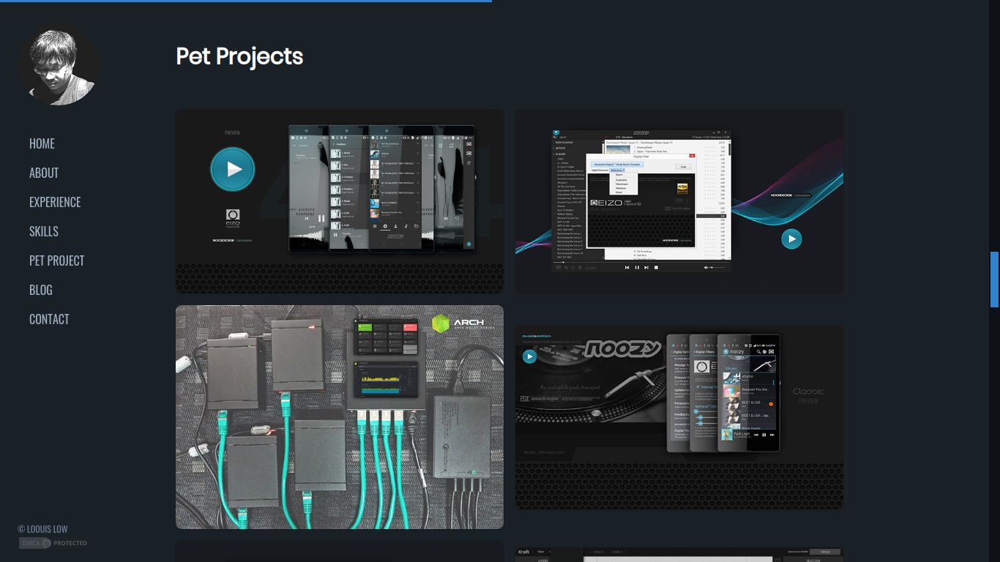
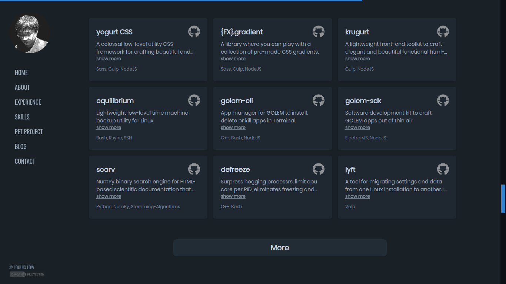
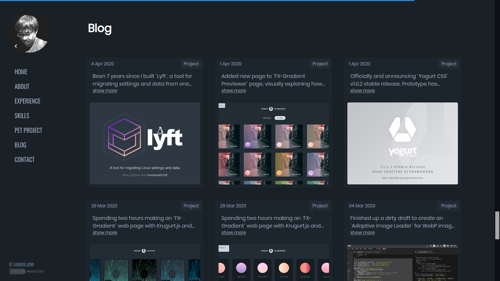
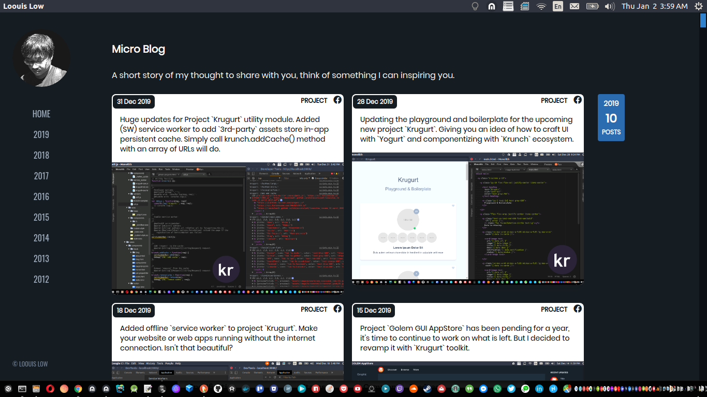

[](https://app.netlify.com/sites/loouislow-portfolio-44af06/deploys)

# My Personal Portfolio Website

> [https://loouislow81.github.io](https://loouislow81.github.io)

<p align="left">
  
  
  
  
  
  
  
  
  
  
  
  
</p>

> [project source code](https://github.com/loouislow81/loouislow81.github.io/tree/2.x.x)

<p align="left">
  
  
  
  
  
  
  
  
</p>

## contents

- About
- Experience
- Skills
- Pet Projects
- Blog
- Contact

## featuring

- PWA app for all platforms.
- 100% work offline.
- image adaptive loader for different connection speed.
- use raw JSON as payload.
- crafted in pure html-based web component.
- all that above was built with [Krugurt.js](https://github.com/loouislow81/krugurt) and [Yogurt.css](https://github.com/yogurt-foundation) ui toolkits.

## responsive screens support

- `320` 320px screen (primitive)
- `2k` 1920px screen (new)
- `4k` 3840px screen (new)

## terminal

if you prefer a nerdy way, use the Terminal version,

```bash
$ npx loouislow-resume
```

Thanks for viewing.

Enjoy!

---

MIT
