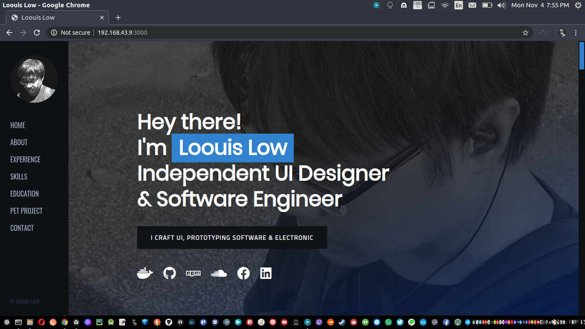
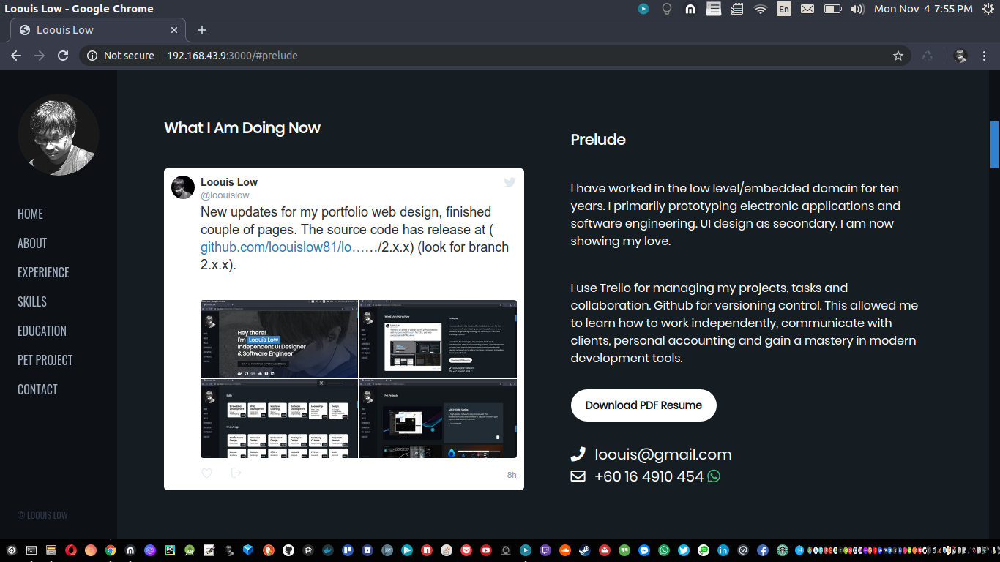
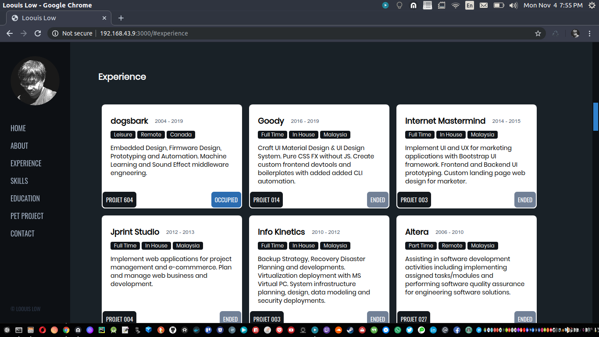
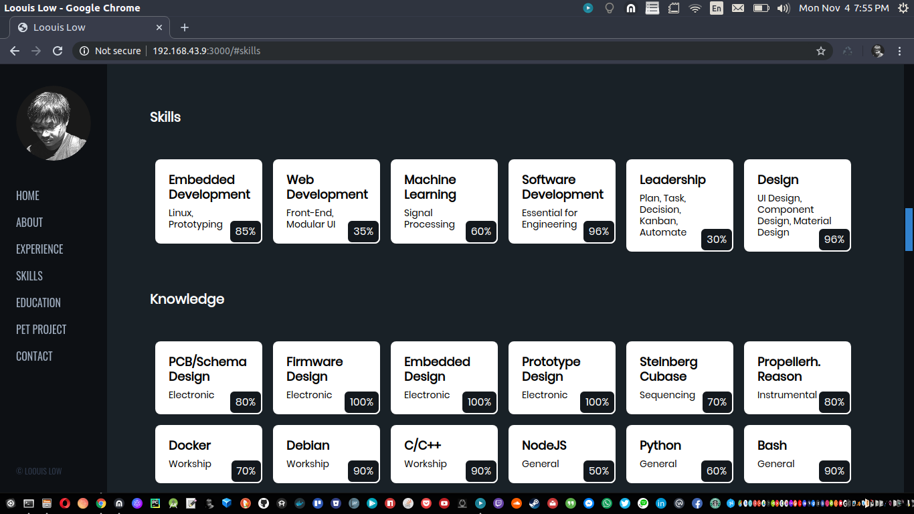
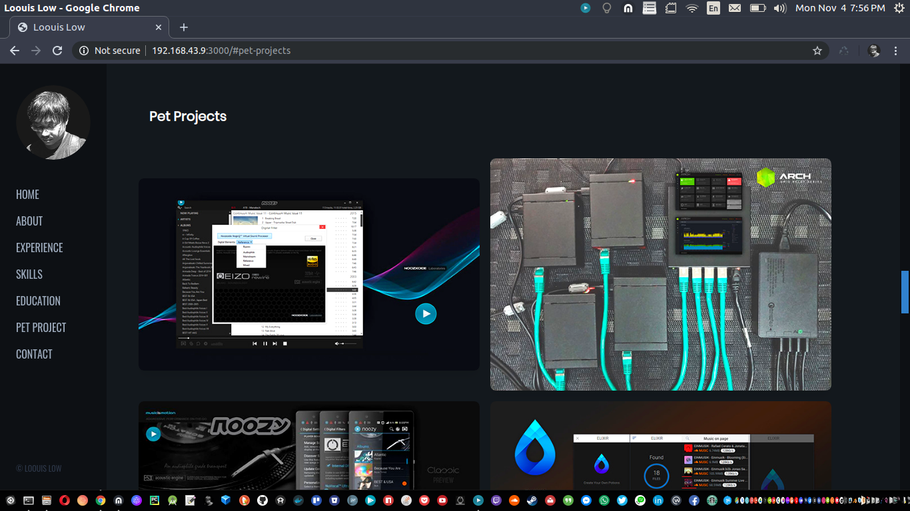
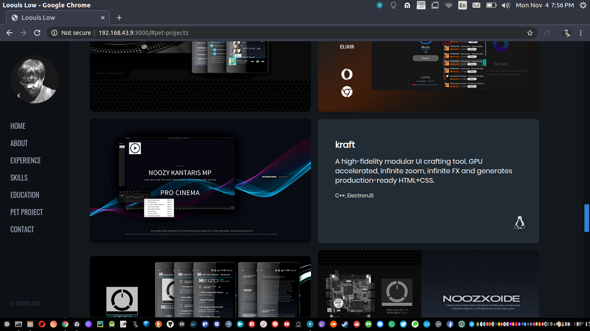
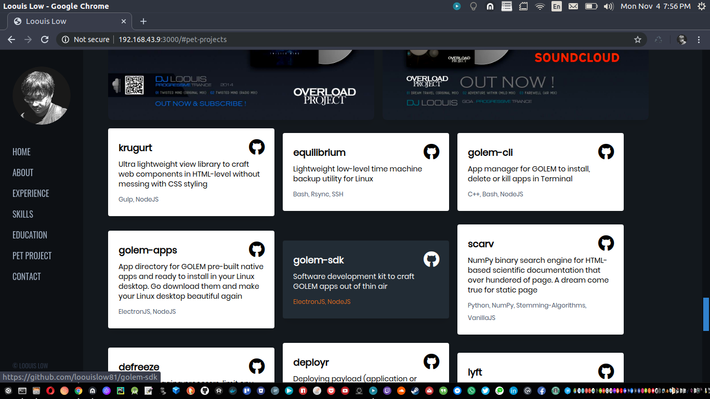
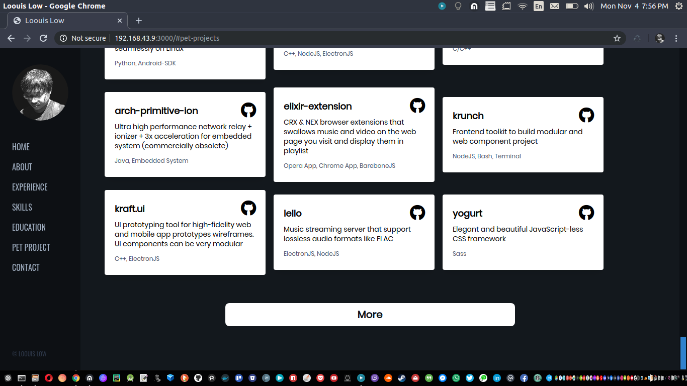

# My Personal Website

<p align="left">
  
  
  
  
  
  
  
  
  
  
</p>

## https://loouislow81.github.io

- About
- Experience
- Skills
- Education
- Pet Projects
- Contact

## build

```bash
$ npm run build-all
```

Thanks for viewing.

Enjoy!

