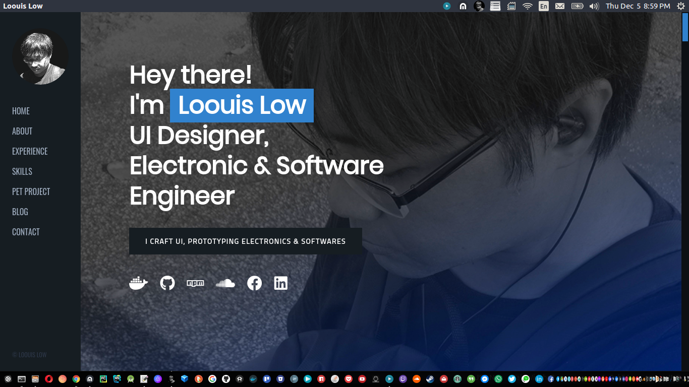
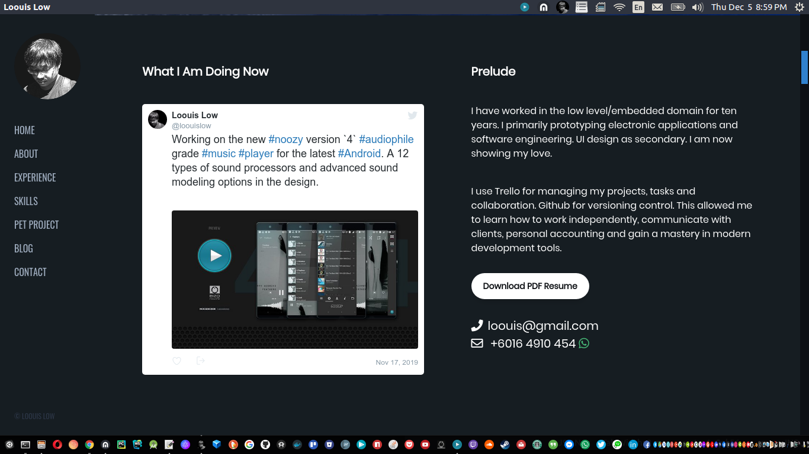
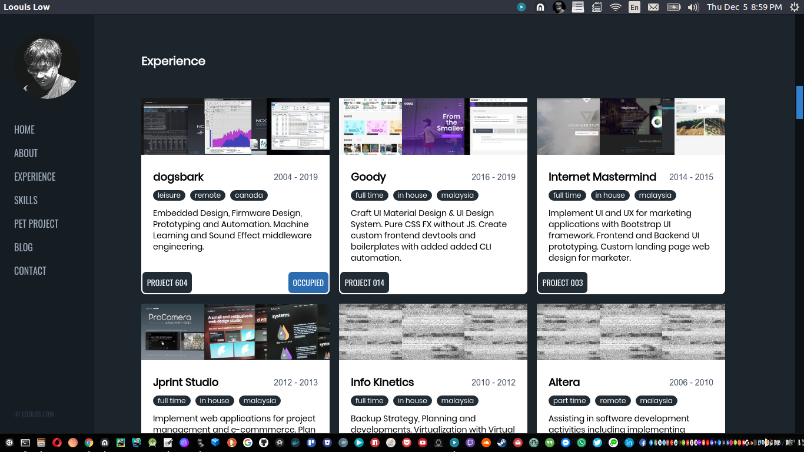
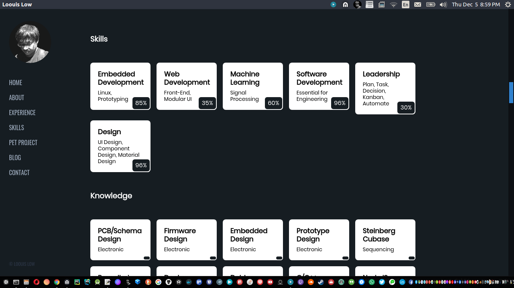
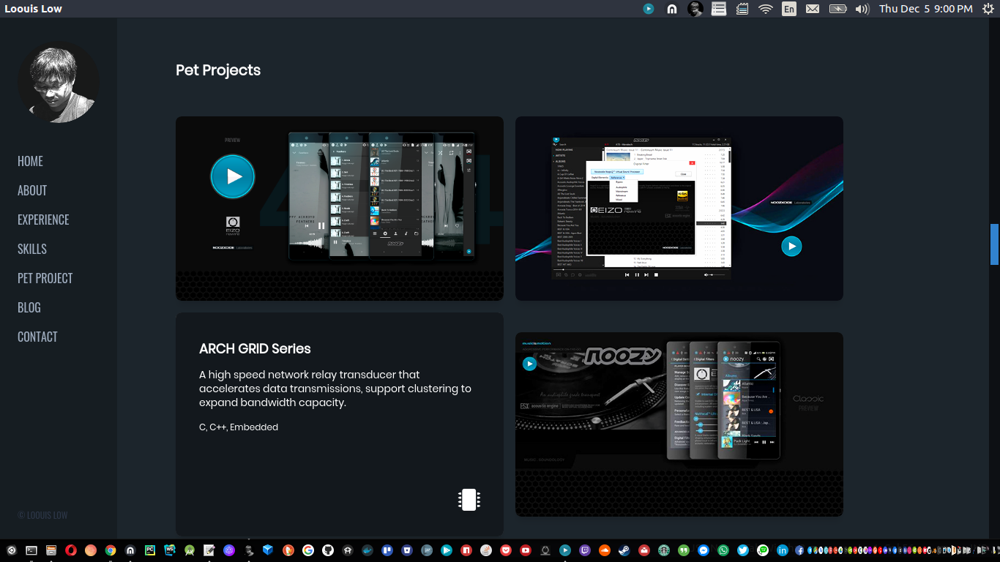
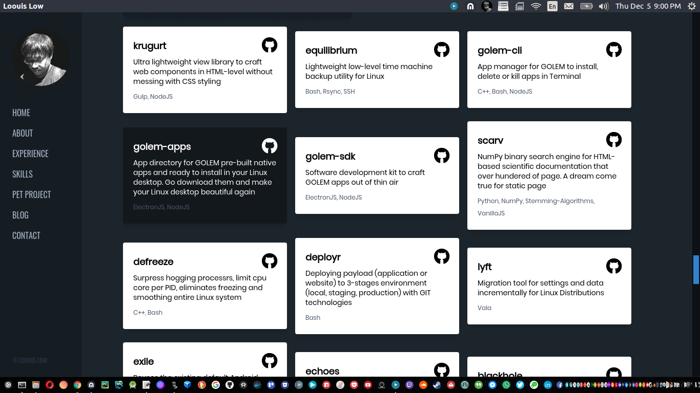
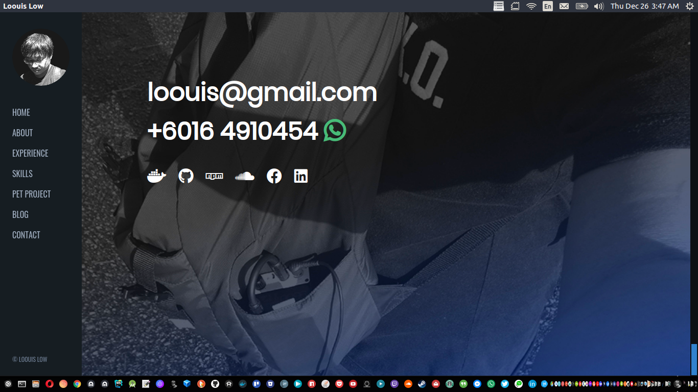
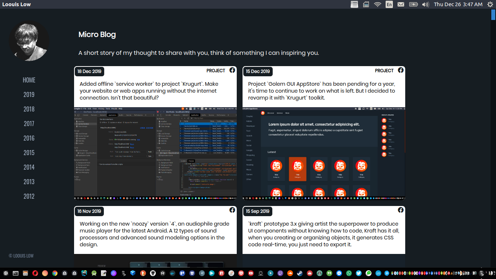

# My Personal Website

  
  
  
  
  
  
  
  

## https://loouislow81.github.io

- About
- Experience
- Skills
- Pet Projects
- Blog
- Contact

## featuring

- PWA installable to all platforms
- work offline
- use JSON as payload
- component based
- build with [Krugurt](https://github.com/loouislow81/krugurt) ui toolkit.

## todo

- support `2k` screen sizes (optimized)
- support `4k` screen sizes (WIP)

Thanks for viewing.

Enjoy!

