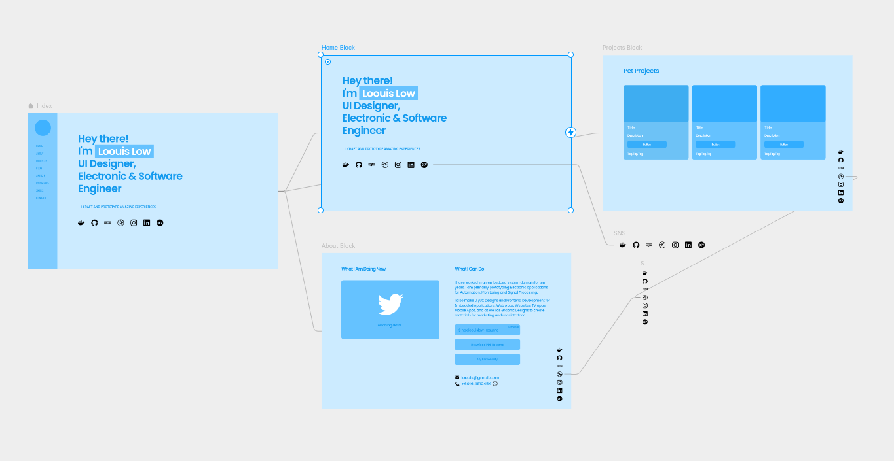
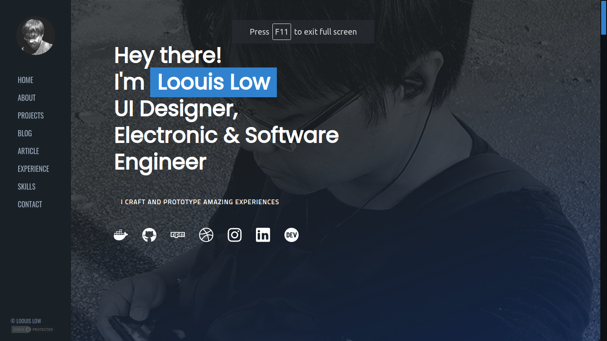
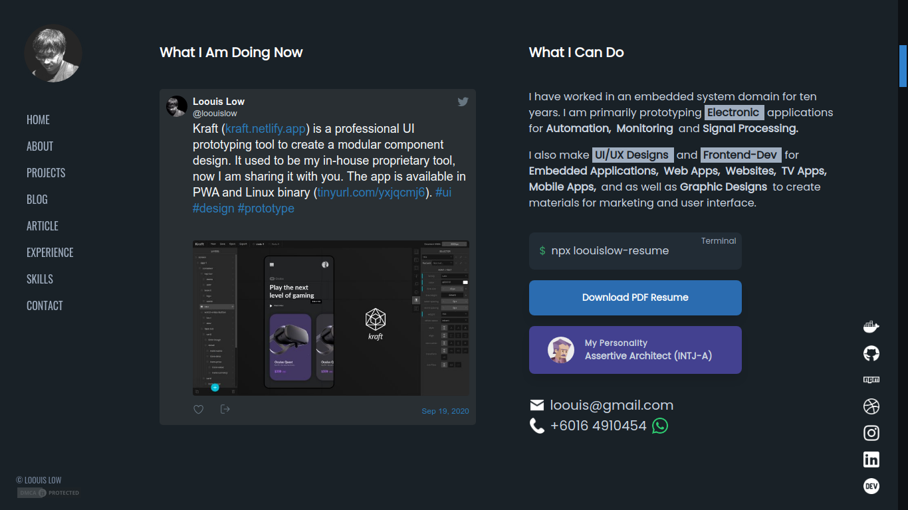
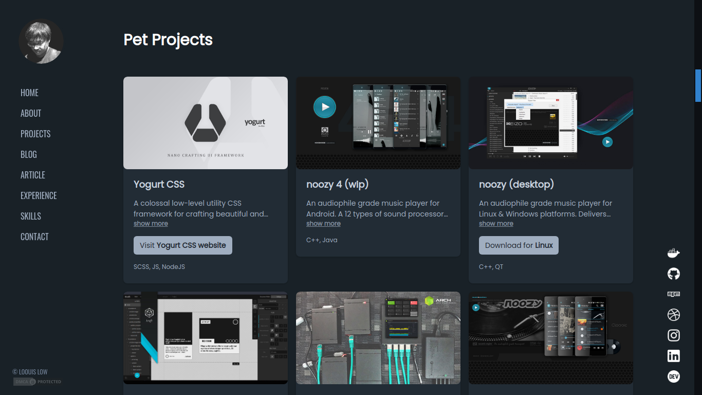
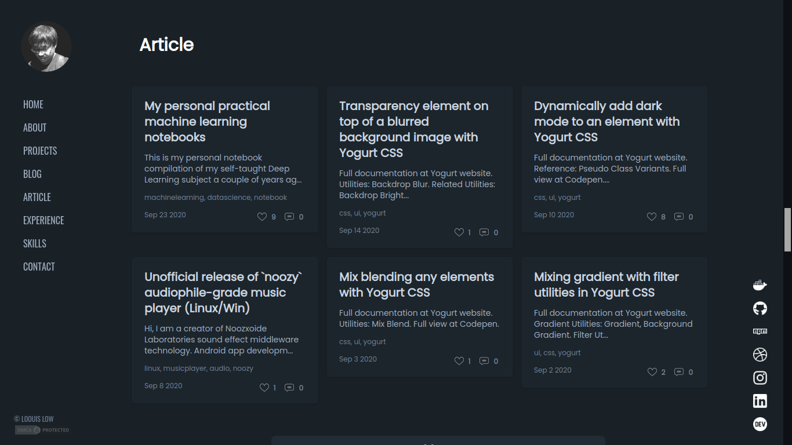
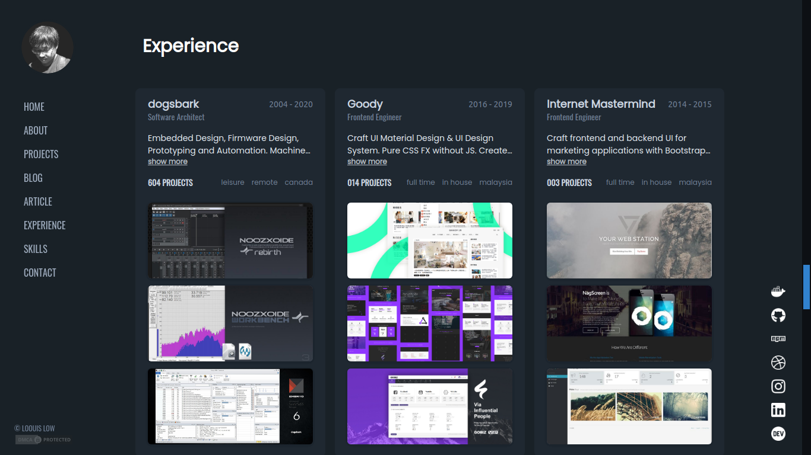
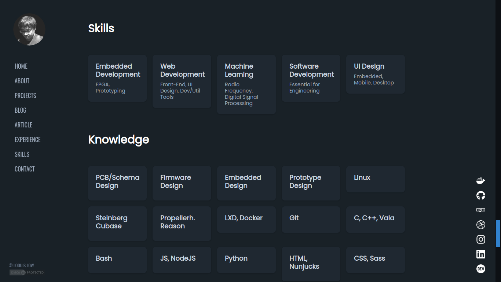
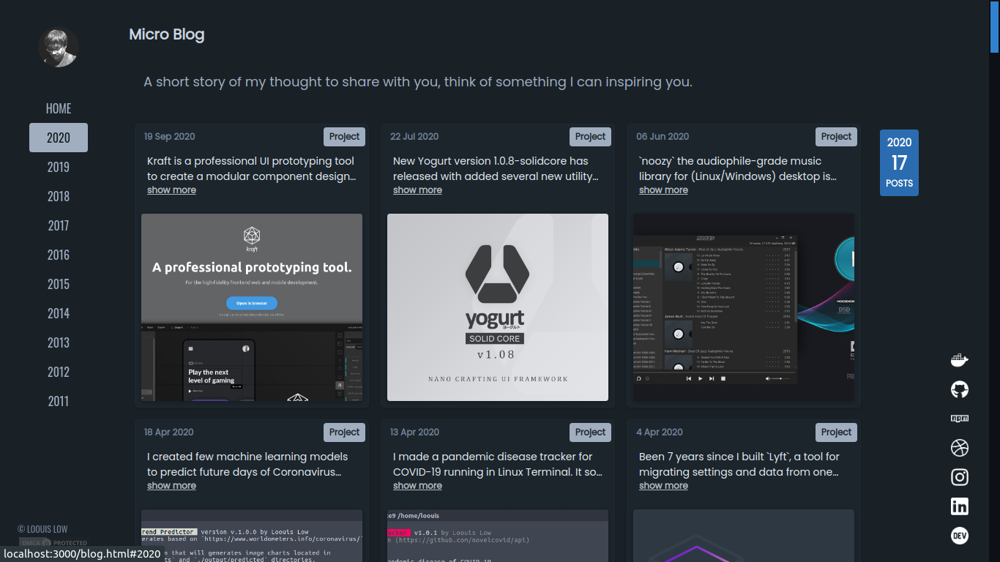

[](https://app.netlify.com/sites/lewislow/deploys)

# My Portfolio Website

> [https://lewislow81.github.io](https://lewislow81.github.io)

---

### _prototype

<p align="left">
  
</p>

### _screenshots

<p align="left">
  
  
  
  
  
  
  
  
</p>

### _content

- About
- Projects
- Blog
- Article
- Experience
- Skills
- Contact

### _build

Grab a repo and installing necessary packages,

```bash
$ git clone --branch 2.x.x https://github.com/lewislow81/lewislow81.github.io.git
# YARN
$ yarn
# NPM
$ npm i
```

For development mode,

```bash
# YARN
$ yarn build-dev
# NPM
$ npm run build-dev
```

For production mode,

```bash
# YARN
$ yarn build-prod
# NPM
$ npm run build-prod
```

Enjoy!
